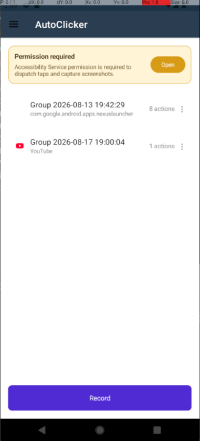
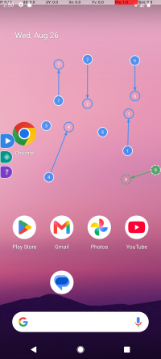
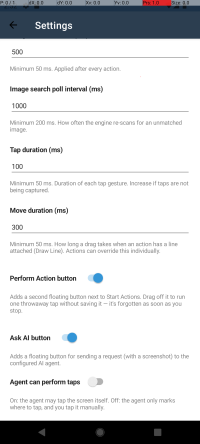
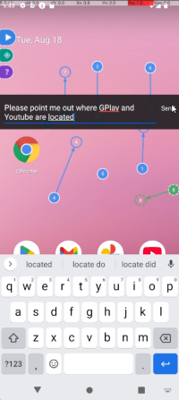

**AutoClickerMaui** is a free, open-source Android app that automates repetitive tapping in any app or on your home screen.
You record a sequence of taps once — either at fixed coordinates or targeting a specific image on screen — and the app replays them in a continuous loop, with no root access required.
It can also hand control of the screen to an AI agent, which watches a screenshot of your app and either marks where to tap or taps for you.

## Screenshots

## Features

- **Record & replay tap sequences.** Draw numbered action markers directly on top of any app to build a "group" of steps, then play the whole sequence back on a loop.
- **Two click modes:**
  - **Coordinate click** — taps a fixed (X, Y) point every time.
  - **Image click** — crop a small region of the screen as a template; during playback the app repeatedly scans the screen and taps once that image appears (or taps the live matched location as it moves), so sequences keep working even if elements shift on screen.
- **Interrupt actions.** Flag any image click as an **interrupt** (Action settings → "Interrupt", or "Make interrupt" in the marker's radial menu) to take it out of the numbered sequence. Interrupts are checked on every screenshot during playback — before each step and on every poll while a step waits for its image — and when one is found it is tapped (using its normal Image Click / Image Position Click behaviour) before the current step is retried. An interrupt that isn't on screen is skipped without waiting. Use it for popups, "OK"/"Close" dialogs or ads that can appear at any time. Interrupt markers show a double ring and are numbered separately (`!1`, `!2`, …). Note that when a group has interrupts, coordinate clicks take one screenshot before tapping, which Android rate-limits to a few per second.
- **Swipe / drag actions.** Attach an End point to any marker via the "Draw Line" radial menu option to turn a simple tap into a swipe or drag gesture between two points.
- **Per-app groups.** Each recorded sequence remembers which app it was recorded against (shown with that app's name and icon), or is tagged "Desktop" if recorded on the home screen. Selecting a group can bring its target app to the foreground automatically for editing.
- **Floating overlay controls.** Draggable, dockable buttons float over your screen while recording or playing: drag them out of the way, tap Start Actions to run the loop, long-press a marker for its radial menu (settings, draw line, template preview), and a one-time onboarding walkthrough introduces the controls the first time the overlay opens.
- **AI agent ("Ask AI").** An optional floating button lets you type a plain-language request (e.g. "tap the Buy button"); the app sends a screenshot and your request to an LLM you configure, which can either mark where to tap for you to confirm (**Show Location** mode) or tap on your behalf (**Auto Click** mode) — see [AI Agent](#ai-agent) below.
- **Conversation log.** A flyout page showing everything exchanged with the AI agent — your prompts, the screenshots it saw, the tool calls it made, and its replies — for transparency into what it did and why.
- **Tunable timing**, via the in-app Settings page:
  - Delay between clicks (default 500 ms)
  - Image search poll interval — how often the app rescans for an image target (default 1000 ms)
  - Tap duration — length of the simulated tap gesture (default 100 ms)
- **No root required.** Taps and screenshots are performed through Android's built-in Accessibility Service APIs.

## How it works

1. **Grant permissions** the first time you open the app — see [Permissions](#permissions) below.
2. On the **home screen**, tap **Record** to start a new group, or select an existing group and tap **Edit** to modify it.
3. A floating overlay appears over whatever app is in front. Tap anywhere to drop a numbered marker (a coordinate click), or use the crop tool to select a region of the screen to record an image-based click.
4. Drag markers to reposition them, long-press a marker to open its radial menu (settings, draw a line to add a swipe end point, preview/reselect an image template), or open a marker's menu to delete it.
5. Tap the floating **Actions** button to start playback — the app replays your recorded steps in a loop until you tap Actions again or press Back.
6. Back on the home screen, rename or remove any group from its "⋮" menu, and adjust timing under **Settings**.

## AI Agent

AutoClickerMaui can call out to an AI model to help you build or drive a sequence, instead of (or alongside) recording one by hand.

1. Open **AI Agent settings** and choose your provider (OpenAI, Grok, Gemini, Azure OpenAI, a self-hosted/local endpoint, or GitHub Copilot CLI), then supply its endpoint URL and API key. If you have a screenshot or photo of those credentials, the **Scan** button can read them for you: it takes a photo, recognizes text on-device, and auto-fills the endpoint/key fields for you to review before saving — nothing is uploaded anywhere for this step.
2. Pick an **agent click mode**:
   - **Show Location** — the agent may only view screenshots and drop markers for you to confirm; it never taps on its own.
   - **Auto Click** — the agent may also tap on your behalf.
3. While recording or playing, tap the **Ask AI** button on the overlay and type what you want done. The app sends the model a screenshot, your request, and context about the app currently in focus; the model responds by adding markers, tapping, or replying with text, which appears as a floating bubble and is recorded in the **Conversation log**.
4. Automation and agent runs stop automatically if you leave the target app (e.g. go home or switch apps), so the agent can't act on the wrong screen.

Conversation history is kept only in memory by default for the current session and is not written to disk. No screenshot or credential data is sent anywhere except to the AI provider you configure.

## Permissions

AutoClickerMaui needs the following to function:

| Permission | Why it's needed |
|---|---|
| **Accessibility Service** | Lets the app take screenshots (for image matching and the AI agent) and dispatch simulated taps and gestures. Must be enabled manually — the app shows a banner with a shortcut to Android's Accessibility settings if it isn't. |
| **Display over other apps** (`SYSTEM_ALERT_WINDOW`) | Draws the recording/playback overlay (markers, Actions button, Ask AI button) on top of other apps. |
| **Foreground service / notifications** | Keeps the overlay and click engine running reliably while another app is in the foreground; shows a persistent notification while active (required on Android 13+). |
| **Camera** | Used only by the optional Connection Scan feature to photograph and auto-fill AI provider credentials; not required for tap/image automation. |

None of this data leaves your device except when you explicitly configure and use the AI Agent feature, in which case screenshots and your prompts are sent only to the AI provider you set up. Image templates used for image matching are processed only locally and are never uploaded.

## Requirements

- Android 5.0 (API 21) or later.
- Not currently available for iOS, Windows, or macOS.

## Installation

AutoClickerMaui isn't published on the Play Store. Each push to the main branch is automatically built, signed, and published as an APK.

1. Download the latest **.apk**.
2. On your Android device, allow installation from unknown sources if prompted.
3. Install the APK and open the app.
4. Follow the in-app permission prompts before recording your first sequence.

## Disclaimer

Automating taps may violate the terms of service of some apps or games. Use AutoClickerMaui responsibly and at your own risk.
